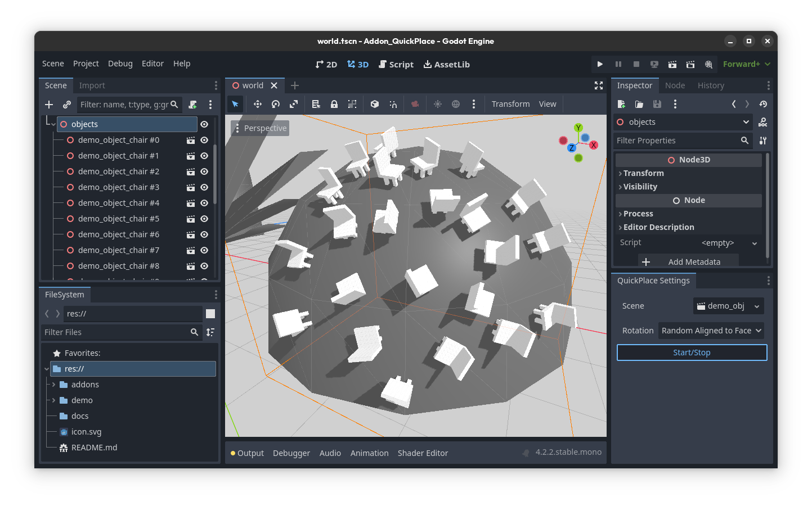

# QuickPlace
Quickly place packed scenes and optionally rotate towards faces and randomize its position

## Features
- **Quickly place PackedScene's**
    - Start placement mode and select a Node3D to be used as a parent, then click in your 3D viewport to quickly place your PackedScene.
- **Randomize rotation**
    - Randomize the rotation on all axis to quickly scatter objects like rocks
- **Align to Face**
    - Align the bottom of the PackedScene to the normal of the face you clicked
- **Random Aligned to Face**
    - First, align the bottom of the PackedScene to the normal of the face you clicked. Then, randomize the (local) Y-rotation.

## Installation
1. Download the latest release
2. Place the ``quick_place`` folder into your ``addons`` folder
3. Activate the addon

## Support
Any version from 4.0 onwards should be compatible. The addon was created and tested with 4.2.2.

## Donations
If you would like to support my open source projects, feel free to [drop me a coffee (or rather, an energy drink)](https://ko-fi.com/laurasofiaheimann) or check out my [release games](https://indiegesindel.itch.io) on itch.

## License
This project is licensed under the MIT License. For more information, check out the included [LICENSE](LICENSE) file.